# User manual for  system

## Home

In home page you can find some general information about this project (*see Picture 1*).

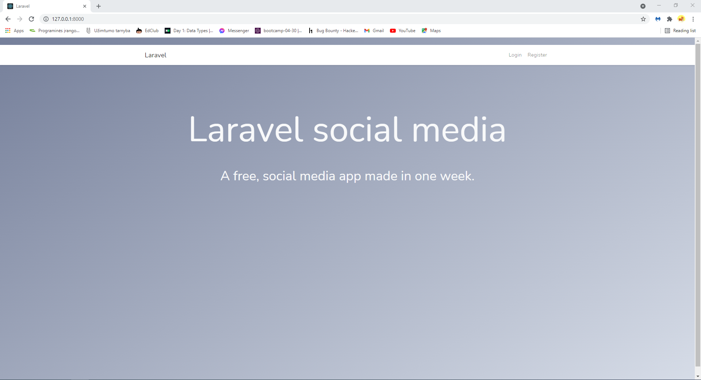
*Picture 1*

## Register

To register a new user account press register icon in the top right corner (*see Picture 2*). In user registration form fill in all fields and press **“Register”** (*see Picture 3*). If you made mistakes while filling the form, you will get error messages indicating what to correct. Note that error messages apply to all system forms. Once corrections are done press **“Register”** again. Upon successful registration you will be redirected to dashboard page. 

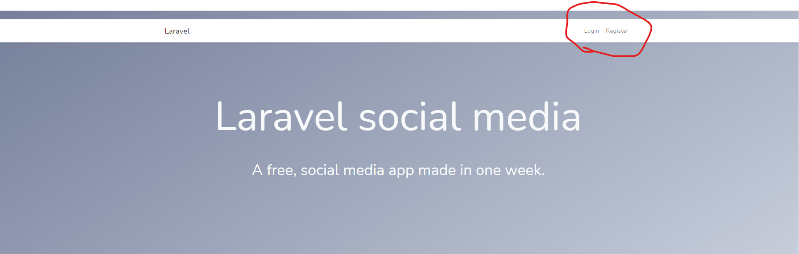
*Picture 2*

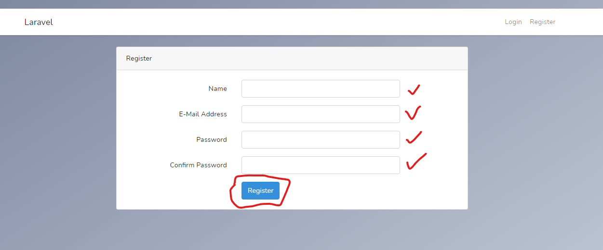
*Picture 3*

## Login

To login as already registered user press login icon in the top right corner of the screen (*see Picture 4*). In the user login form fill in all fields and press **“Login”** (*see Picture 5*). You will get error messages indicating mistakes just like in registration form. After successful login you will be redirected to dashboard page.

*Picture 4*

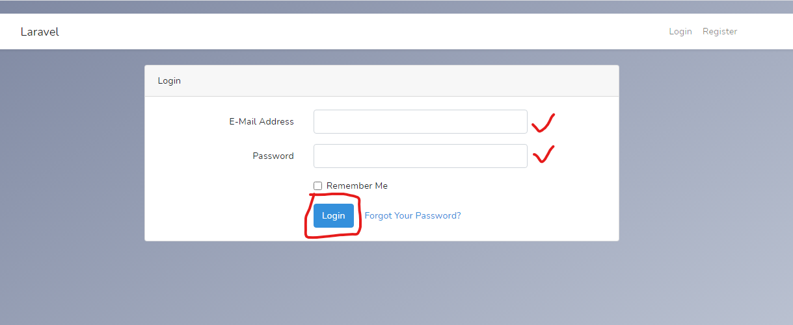
*Picture 5*

## Logout

If you want to logout from the system press your user name in the top right corner and then Logout of the screen (*see Picture 6*).

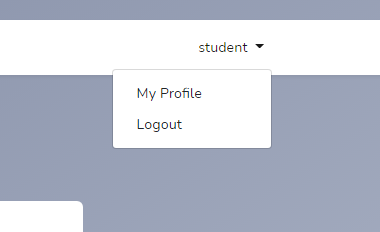
*Picture 6*

## Dashboard

Dashboard page is where you can find latest posts (*see Picture 7*). You can serch, go to landing page, comment on a post, go create a post, govie posts comments, like a post.

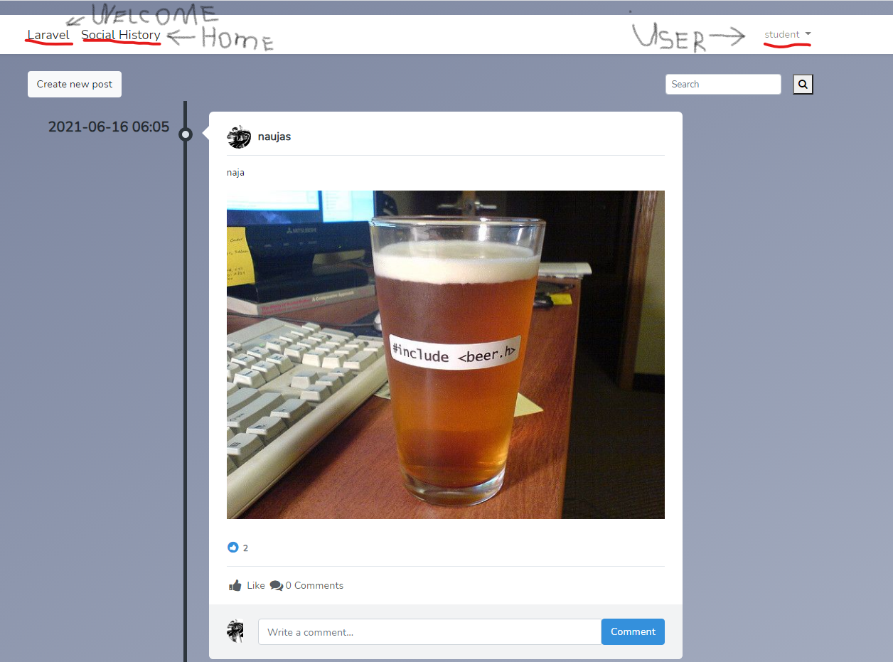
*Picture 7*

## Create new post

On dashbord page, in the top left corner click button **“Create new post”**. It will riderect to new form (*see Picture 8*). Fill in text area field and if you want add a image and press **“Make a post”**.

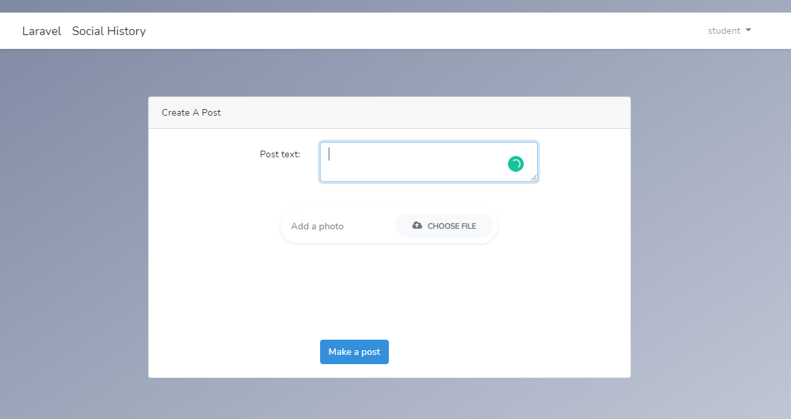
*Picture 8*

## Edit post

To edit post press on a post that you created **“Comments”** (*see Picture 9*) 
Then in top left press **“Edit post”** (*see Picture 10*). Change the fields you want and press **“Edit post”** button (*see Picture 11*). If latter happens, correct mistakes and try again. Same rules apply when editing user.

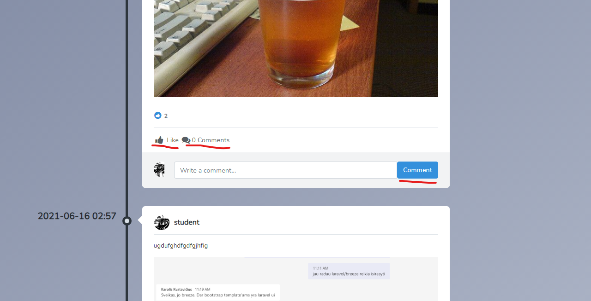
*Picture 9*

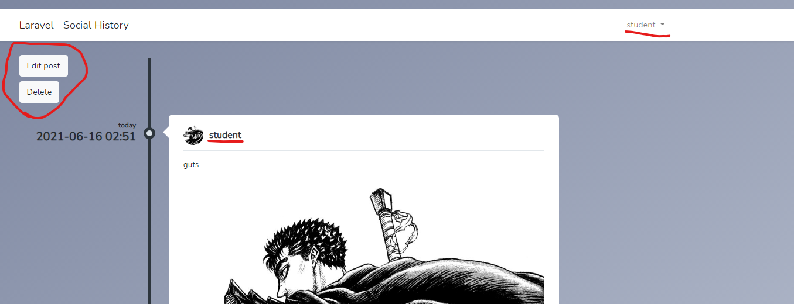
*Picture 10*

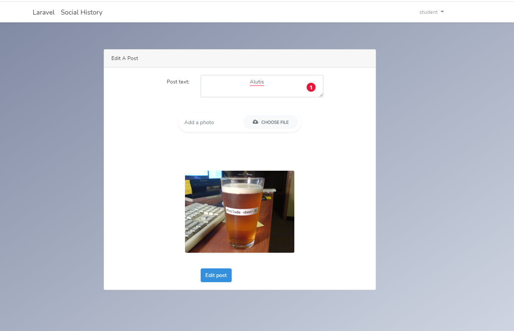
*Picture 11*

## Delete post

To delete a post press **“Delete”** button next to **“Edit post”** (*see Picture 12*). You can not delete or edite post that you have not created.

*Picture 12*

## Comment/Likes

You can comment on a post inside post with comments pade and in dashboard
(*see Picture 13*) and (*see Picture 14*). You can also like on a post.

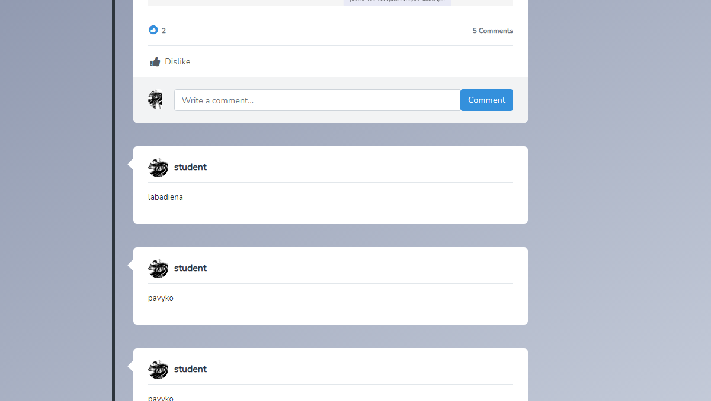
*Picture 13*

*Picture 14*

## Profile

You can visit you profile and see data about you (*see Picture 15*). And you can edit your user name and add or change your user image (*see Picture 16*).

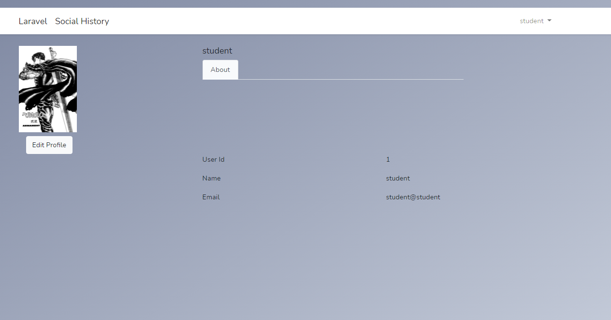
*Picture 15*

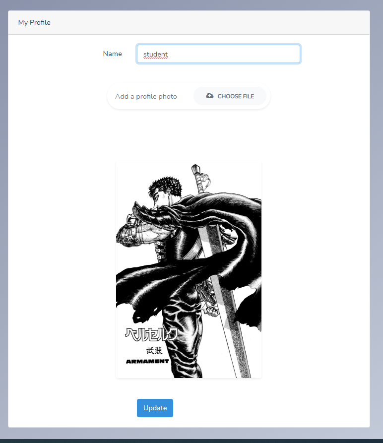
*Picture 16*